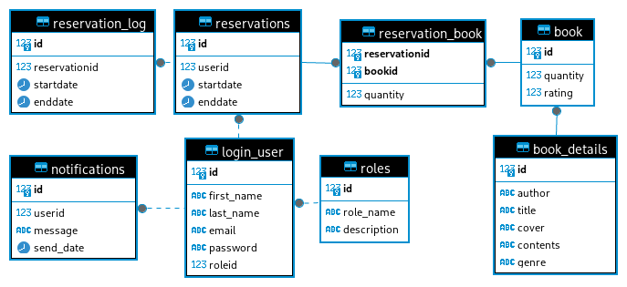

## Schemat bazy danych

Książki są reprezentowane przez dwie tabele: `book` przechowującą liczbę egzemplarzy i ocenę użytkowników oraz `book_details` zawierającą szczegółowe dane na temat samej książki. Tabela `reservations` zawiera informacje dotyczące wypożyczeń, a ze względu na możliwość wydłużenia wypożyczenia, wprowadzono tabelę `reservation_log` przechowującą historyczne dane związane z wypożyczeniami. W tabeli `login_user` znajdują się standardowe informacje dotyczące kont użytkowników, takie jak imię, nazwisko i dane logowania. Każdy użytkownik jest przypisany do konkretnej roli, definiującej jego uprawnienia, a system umożliwia elastyczne dodawanie nowych ról według potrzeb. Tabela `notifications` zawiera dane o wysyłanych powiadomieniach mailowych, co jest istotne w celu uniknięcia powtórnej wysyłki tych samych powiadomień.

## Użyte technologie

1.  Spring Boot

    -   Wykorzystywany do stworzenia aplikacji, zarządzania konfiguracją, oraz inicjalizacji kontekstu Spring. W `Main.java` kluczowe jest oznaczenie klasy adnotacją `@SpringBootApplication`, co umożliwia automatyczne skonfigurowanie kontekstu Spring.

1.  Spring Data R2DBC

    -  Służy do interakcji z bazą danych PostgreSQL (hostowaną przez serwis Supabase) w sposób reaktywny. W `Connection.java` skonfigurowano połączenie z bazą danych, a interakcje z bazą danych obsługiwane są poprzez repozytorium `UserDAO` w `dao` oraz `RegisterService` w `service`, gdzie dodano nowego użytkownika.

1.  JavaFX

    -  JavaFX używane jest do stworzenia interfejsu graficznego. W `RegisterPageController.java` zaimplementowano obsługę rejestracji użytkownika z wykorzystaniem pola tekstowego, etykiet, i przycisków, a także walidację wprowadzanych danych.

1.  Reaktywne programowanie

    -  Framework Spring WebFlux oraz biblioteka Reactor używane są w kontekście reaktywnego programowania. W interakcjach z bazą danych, takich jak dodawanie nowego użytkownika w `RegisterService`, korzysta się z asynchronicznych operacji, co umożliwia efektywne zarządzanie równoczesnymi żądaniami.

1.  Lombok

    -  W klasach modelu, takich jak `LoginUser` czy `BookDetails`, Lombok ułatwia tworzenie getterów, setterów, oraz innych rutynowych fragmentów kodu, co przyspiesza rozwój projektu.

## Flow aplikacji

Aplikacja zaczyna się od inicjalizacji Spring Boot i uruchomienia interfejsu JavaFX, gdzie użytkownicy mogą się rejestrować. Kontroler `RegisterPageController` obsługuje interakcje użytkownika, korzystając z usługi `RegisterService` do walidacji i zapisu danych do bazy PostgreSQL przy użyciu repozytorium `UserDAO`. Klasa `SceneChanger` umożliwia dynamiczną zmianę scen, zapewniając płynną nawigację między widokami w interfejsie graficznym.

## Napotkane problemy

W trakcie implementacji napotkaliśmy problem z nieprawidłowym działaniem sprawdzania dostępności e-maila w sytuacji, gdy e-mail nie istniał jeszcze w bazie danych. Dotychczasowa metoda `block` oczekiwała na sygnał `Mono`, jednak w przypadku braku danych nie otrzymywała żadnej odpowiedzi. Aby rozwiązać ten problem, zastąpiliśmy tę metodę wywołaniem `blockOptional`.
